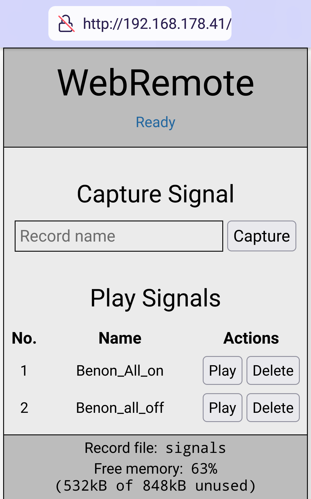

# WebRemote-MPY

## Motivation
I use several remote controlled (RC) power plugs at home, since they make turning on lights
and other devices easy. This is especially convenient when the power switches are in
inaccessible places or far away. 

Although all RC power plugs operate at the 433 MHz band, the RC protocolls of different brands of
can be incompatible. Therefore, using RC power plugs from different brands requires multiple transmitters each specific for 
their brand. To overcome this inconvenience, I developed a setup to operate all signals in one place.

## Description

 WebRemote can record the signals of different handheld 433 MHz transmitters and make them accessible via a simple web interface. This eliminates the need of multiple brand-specific remotes for similar 433 MHz devices in home automation. WebRemote can connect to the local WiFi which makes the web interface accessible for all devices (e. g. mobile phones, computers) in the local WiFi.

WebRemote uses minimal hardware setup comprised of a Raspberry Pi Pico W (RPI), a 433 MHz Transmitter (TX) and a 433 MHz Receiver (RX).

The software is relies on Peter Hinch's micropython_remote to operate the Transmitter and the Receiver.
Microdot is used to create a simple web server which provides the basis for the web interface.
AJAX requests (using jQuery) are used to implement communications between the web interface and the web server.
