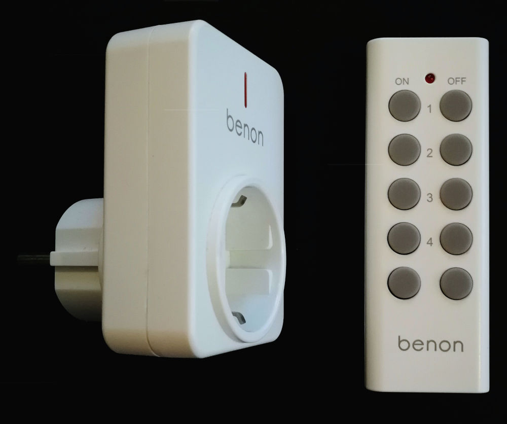
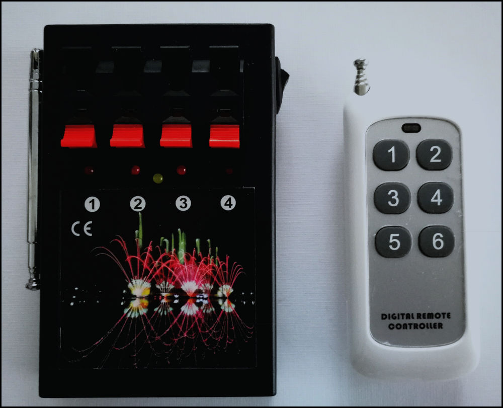
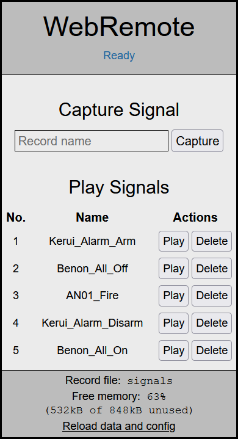
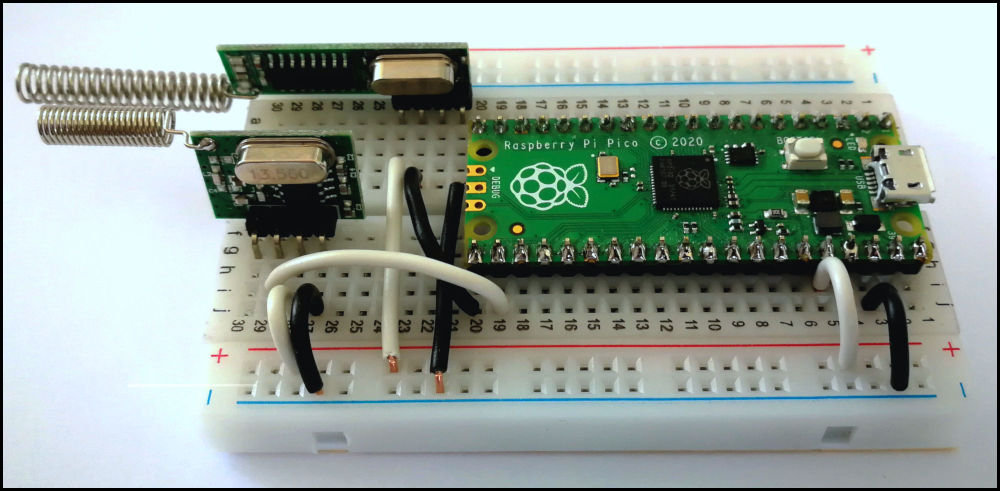
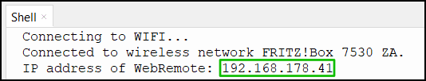
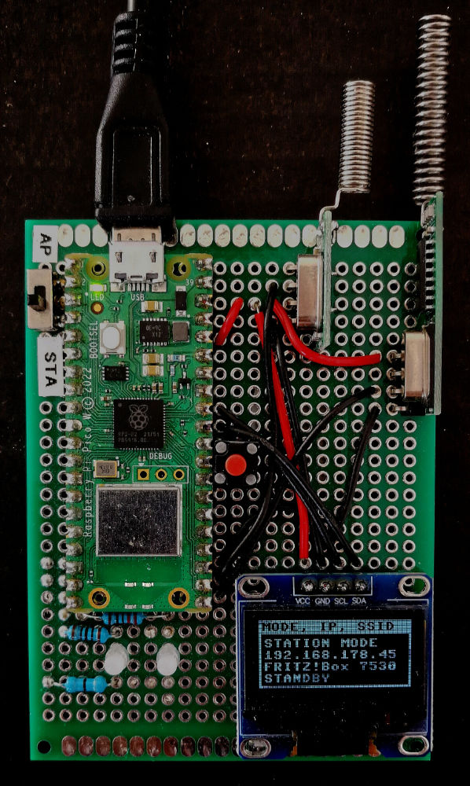

# WebRemote-MPY

## Motivation


I use several remote controlled (RC) power plugs at home, since they make turning on lights
and other devices easy. This is especially convenient when the power switches are in
inaccessible places or far away. 

Although all RC power plugs operate at the 433 MHz band, the RC protocolls of different brands of
can be incompatible. Therefore, using RC power plugs from different brands requires multiple transmitters each specific for 
their brand. To overcome this inconvenience, I developed a setup to operate various rc signals in a single web interface.


This programm (WebRemote) can record the signals of different handheld 433 MHz transmitters
using on-off-keying protocoll (OOK) and makes them accessible via a single web interface. 
This eliminates the need of multiple brand-specific remotes.
Furthermore, WebRemote can connect to the local WiFi which makes the web-interface
accessible for all devices (e. g. mobile phones, computers) in the local WiFi.

## Description

 WebRemote can record the signals of different handheld 433 MHz transmitters and make them accessible via a simple web interface. This eliminates the need of multiple brand-specific remotes for similar 433 MHz devices in home automation. WebRemote can connect to the local WiFi which makes the web interface accessible for all devices (e. g. mobile phones, computers) in the local WiFi.

WebRemote uses minimal hardware setup comprised of a Raspberry Pi Pico W (RPI), a 433 MHz Transmitter (TX) and a 433 MHz Receiver (RX).

The software is relies on Peter Hinch's [micropython_remote](https://github.com/peterhinch/micropython_remote) to operate the Transmitter and the Receiver.
[Microdot](https://github.com/miguelgrinberg/microdot) is used to create a simple web server which provides the basis for the web interface.
AJAX requests (using jQuery) are used to implement communication between the web interface and the web server.

## Setup

Components:
- Raspberry Pi Pico W
- Breadboard and wires
- 433 MHz Transmitter (WL102-341) + Antenna
- 433 MHz Receiver (RX470C-V01) + Antenna



The supplied antennas were soldered onto the Transmitter (short antenna) and Receiver (long antenna).
A minimum setup consisting only of a RPI and a 433 MHz Transmitter and Receiver
(detailed information provided below) was installed on a small breadboard.

Wiring:
- RX-Vcc, TX-Vcc: 3.3V (Pin 35)
- RX-GND, TX-GND: RPI GND (e. g. Pin 38)
- RX-DATA: RPI GPIO 16
- TX-DATA: RPI GPIO 17

RPI was connected to a computer via USB which provides the power supply.


## Installation

1. MicroPython V 1.23.0 firmware is installed on the Raspberry Pi Pico W.
2. The programm files in the /dist folder are copied onto the RPI using Thonny
3. Open the main programm (main.py) and customize the WiFi settings provided as global constants / variables in the config section of the programm:
```python
"""Config"""
WR_HEARTBEAT = True   #[True|False] Use onboard LED as heartbead

WR_DATA_FILE = 'signals' #[string:a-Z0-9] Name of the data file used for storage of the signals
WR_CAPTURE_TIMEOUT = const(5000) #[int] Timeout for capture in ms.

WR_STANDARD_MODE = 'STATION' #['STATION'|'AP'] Connection mode of the programm
WR_WIFI_TIMEOUT = const(20) #[int] Timeout for WiFi connection in s

WR_STATION_SSID = 'Local WLan SSID' #SSID of the local wifi for connection in STA mode
WR_STATION_PASSWORD = 'Password12345' #Password of the local wifi for connection in STA mode

WR_AP_SSID = 'WEBREMOTE' #SSID of the AP created in AP mode
WR_AP_PASSWORD = 'micropython' #Password of the AP created in AP mode
				 #Use at least eight characters
```
4. When WiFi connection was successfull the IP address of the web interface is printed in the console of Thonny. 
   - **STA mode**: The web interface can be accessed via browser by every device connected to the same WiFi network as WebRemote using it's IP address as URL.
   - **AP mode**: The web interface can only be accessed by a device directly connected to the access point created by WebRemote. When a device has connected to the AP, the web interface can be accessed via browser using it's IP address as URL.


## Mobile setup


I use this setup at home since it does not require a computer for operation after initial configuration. 
When connected to USB power, all neccessary information are displayed on a display.

I soldered the components listed in section *Setup* onto a circuit board and added some additional components.
Most important, I added an **OLED display** which displays information on the network configuration.
A **toggle switch** is used to select WiFi mode. It allows selection of either AP or STA mode.
A **green LED** and a **red LED** were added to indicate active transmissions and transmission errors, respectively.
A simple push-button acts as a **reset switch**.


